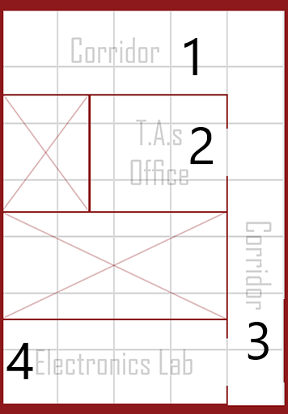

# Localization-App

Localization apps are very important nowdays, they tend to follow certain algorithms and APIs to operate. We aimed during our work to develop a simple app that mimic the way of they work and applied it on a map to one of our school buliding's floor. and we displayed our gui on both a website and a mobile app to wich the user can choose from.

In our development, we had to approaches:

* The Triangulate approach.
* Using Machine-learning (which we used).

### The Traingulate approach

Here, The algorithm is based on calculating the time of recieving a reading from each WiFi, then by already knowing the speed of the signal  transmission through air, we could find the distance the user is away from each WiFi device.

Runing the numbers together through a triangulate algorithm will allow us to detect the exact location of the user.

The downSide: was that the signals received were destorted due to walls and obstcales which delayed their arrival time giving misleading data and hence unaccurate results.

### Machine_learning

We basicly divided the labarotary grounds into different sections (ie. clasifiers) and labeled them each with its own number.

Then, we fired our Esp Module in each section to record the readings of each Wifi available, finally we used the data as training for a Random-Forest model we designed.

And Finally we had an active AI model which can take a new reading and predict the section where the user is standing.
